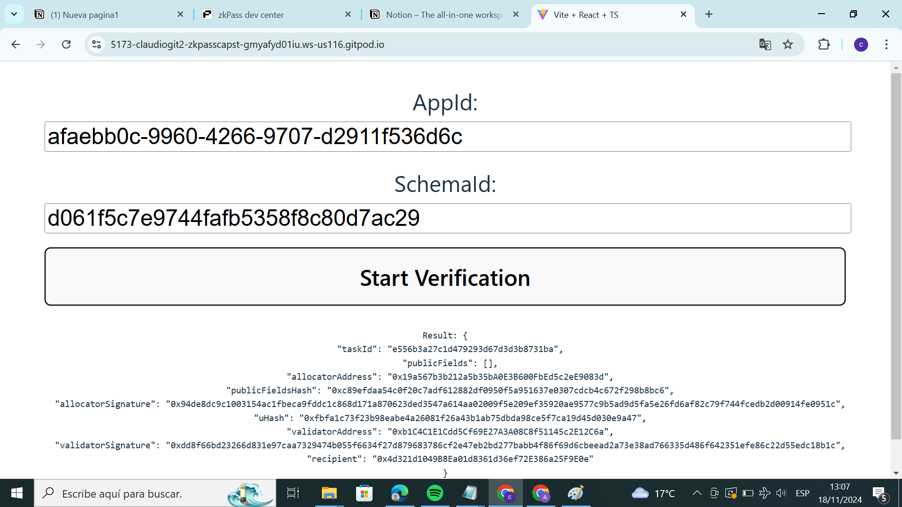
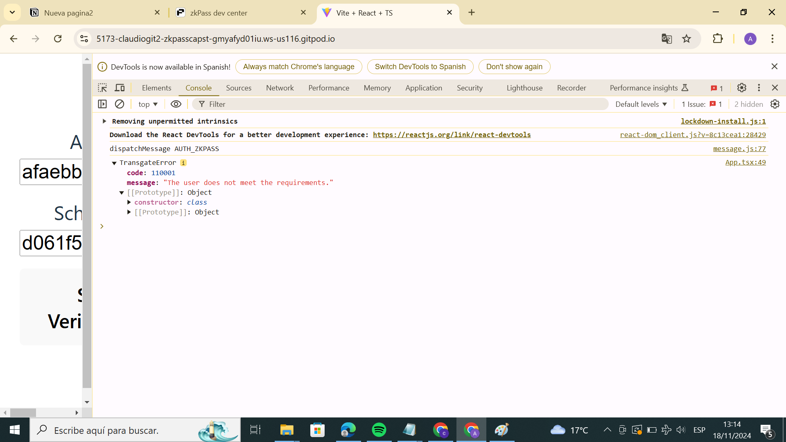

# zkPass Integration: Zero Knowledge Proof Application Guide

## Descripción del Proyecto

Este proyecto explora e implementa **zkPass**, una solución innovadora que utiliza pruebas de conocimiento cero (ZKP) para la verificación de datos con privacidad. Desde la creación de esquemas personalizados hasta el desarrollo de una aplicación web para la validación de datos, esta guía cubre cada paso necesario para integrar zkPass en una aplicación web.

## Objetivos

- Diseñar esquemas personalizados para la verificación de datos.
- Instalar y utilizar extensiones como **zkPass**, **Transgate** y **Schema Validator**.
- Integrar zkPass en una aplicación mediante un esquema personalizado.
- Realizar verificaciones de datos utilizando fuentes fuera de la cadena.

## Requisitos Previos

- **Chromium o Chrome** actualizado.
- Conocimientos básicos de **HTML/CSS/JavaScript/TypeScript** y **React**.
- Instalaciones funcionales de:
  - **Node.js** y **npm**.
  - La extensión de navegador Metamask.
- Un pequeño saldo de ETH en la red **Sepolia** para pruebas.

## Componentes Principales del Proyecto

### zkPass Extension JS-SDK
Este SDK permite a los desarrolladores integrar zkPass en aplicaciones web. Las características principales incluyen:

- **Verificación que preserva la privacidad**.
- **Compatibilidad con HTTPS**.
- **Generación de ZKP eficiente en memoria**.

### Transgate
Una extensión de navegador que facilita el proceso de generación de pruebas zk en un entorno seguro, soportando tanto flujos de datos Web2 como Web3.

### Schema Validator
Permite validar esquemas JSON que definen las fuentes de datos y criterios de verificación.

### JSON Schema
Define las solicitudes de API necesarias para la verificación de datos. Cada esquema incluye:
- Datos del emisor.
- Rutas para las respuestas de la API.
- Condiciones de verificación.

## Proceso del Proyecto

### Pasos Clave
1. **Preparación del entorno**:
   - Configuración de perfiles separados en Chromium para realizar pruebas.
   - Instalación de extensiones zkPass y Metamask.
2. **Creación de un esquema JSON personalizado**:
   - Definición de API y condiciones de verificación.
   - Validación del esquema con el zkPass Schema Validator.
3. **Configuración del entorno de desarrollo**:
   - Inicialización de un proyecto **Vite+React**.
   - Instalación de dependencias clave como `@zkpass/transgate-js-sdk`.
4. **Desarrollo de la aplicación web**:
   - Creación de una interfaz para enviar `AppID` y `SchemaID`.
   - Implementación de lógica para generación y validación de pruebas zk.
5. **Pruebas**:
   - Uso de dos cuentas de prueba en Notion para verificar acceso a páginas.
   - Captura de resultados exitosos y errores.

### Entregables
- Captura de pantalla de un resultado de verificación exitoso.



- Captura de pantalla de un error de Transgate.



## Estructura del Código

### Configuración de la Plantilla
```bash
npm create vite@latest zkpass-app -- --template react-swc-ts
cd zkpass-app
npm install
npm install @zkpass/transgate-js-sdk vite-plugin-node-polyfills ethers
```

### Ejemplo de Configuración del Esquema JSON
```json
{
  "issuer": "Notion",
  "desc": "Verificación de acceso a páginas de Notion",
  "website": "https://www.notion.so/xxxx",
  "APIs": [
    {
      "host": "www.notion.so",
      "intercept": {
        "url": "api/v3/getUserAnalyticsSettings",
        "method": "POST"
      },
      "nullifier": "user_id"
    },
    {
      "host": "www.notion.so",
      "intercept": {
        "url": "api/v3/getPublicPageData",
        "method": "POST"
      },
      "assert": [
        {
          "key": "userHasExplicitAccess",
          "value": "true",
          "operation": "=",
          "verify": true
        }
      ]
    }
  ]
}
```

### Interfaz Web Básica
```tsx
const App = () => {
  const [appId, setAppId] = useState<string>("AppID");
  const [schemaId, setSchemaId] = useState<string>("SchemaID");

  const requestVerifyMessage = async (e: FormEvent) => {
    e.preventDefault();
    try {
      const connector = new TransgateConnect(appId);
      const res = await connector.launch(schemaId);
      console.log("Result:", res);
    } catch (error) {
      console.error("Error:", error);
    }
  };

  return (
    <form onSubmit={requestVerifyMessage}>
      <input type="text" value={appId} onChange={(e) => setAppId(e.target.value)} />
      <input type="text" value={schemaId} onChange={(e) => setSchemaId(e.target.value)} />
      <button type="submit">Verificar</button>
    </form>
  );
};
```

## Recursos Adicionales

- [Documentación zkPass](https://zkpass.org)
- [Repositorio Dev_Antony](https://github.com/claudiogit2019?tab=repositories)

## Conclusión

Este proyecto te introduce a zkPass y cómo puede ser integrado en aplicaciones reales para garantizar la privacidad y seguridad de datos. 


